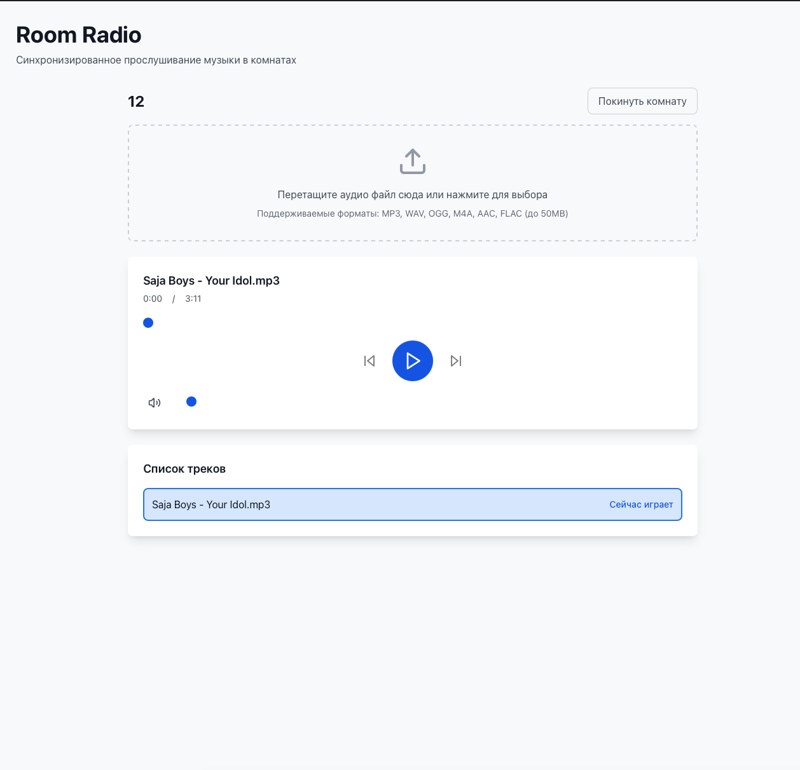

<div align="center">

# Room Radio

### Веб-приложение для синхронизированного прослушивания музыки в комнатах

<p align="center">
  
</p>

<p align="center">
  <a href="#функциональность">🚀 Возможности</a> · 
  <a href="#запуск">📦 Установка</a> · 
  <a href="architecture.md">📚 Документация</a> · 
  <a href="#технологии">⚙️ Технологии</a>
</p>

</div>

<br />

## <a name="функциональность"></a>Возможности

- 🎵 Создание музыкальных комнат
- 📤 Загрузка аудио файлов (mp3, wav, ogg, m4a, aac, flac)
- 🎧 Синхронизированное воспроизведение для всех участников комнаты
- 🔄 Синхронизация в реальном времени через WebSocket
- 📋 Просмотр списка активных комнат
- 🎚️ Управление воспроизведением (play/pause/seek/volume)

## <a name="технологии"></a>Технологии

### Backend
- **FastAPI** - веб-фреймворк
- **WebSockets** - для синхронизации в реальном времени
- **Uvicorn** - ASGI сервер
- **Python 3.12**

### Frontend
- **React 19** - UI библиотека
- **TypeScript** - типизация
- **Vite** - сборщик и dev-сервер
- **Tailwind CSS** - стилизация
- **Zustand** - управление состоянием
- **HTML5 Audio API** - воспроизведение аудио

## <a name="запуск"></a>Установка

### Требования

- Python 3.12+
- [uv](https://github.com/astral-sh/uv) - менеджер пакетов Python
- Node.js (рекомендуется LTS версия)
- npm или yarn

### Backend

1. Установите зависимости:
```bash
uv sync
```

### Frontend

1. Перейдите в директорию frontend:
```bash
cd src/frontend
```

2. Установите зависимости:
```bash
npm install
```

## Запуск

### Backend

Запустите FastAPI сервер:
```bash
uv run uvicorn src.backend.main:app --host 0.0.0.0 --port 7860 --reload
```

Сервер будет доступен по адресу: `http://localhost:7860`

### Frontend

В отдельном терминале, из директории `src/frontend`:
```bash
npm run dev
```

Приложение будет доступно по адресу: `http://localhost:3000`

## Использование

1. **Создание комнаты**: Введите название комнаты и нажмите "Создать комнату"
2. **Загрузка треков**: Перетащите аудио файлы или выберите их через диалог
3. **Воспроизведение**: Нажмите play для начала воспроизведения - все участники комнаты услышат музыку синхронно
4. **Управление**: Используйте кнопки play/pause, перемотку и регулятор громкости
5. **Переключение треков**: Выберите трек из списка для переключения

## Структура проекта

Подробное описание архитектуры проекта находится в файле [architecture.md](./architecture.md).

## Безопасность

- Валидация форматов файлов на backend
- Ограничение размера файлов (50MB)
- Санитизация имен файлов
- CORS настройки для фронтенда
- Хранение файлов в изолированных директориях по комнатам

## Хранение данных

- Комнаты хранятся в памяти (словарь `rooms` в `models/room.py`)
- Аудио файлы хранятся локально в `uploads/{room_id}/`
- При перезапуске сервера комнаты теряются, но файлы остаются

## Лицензия

MIT
